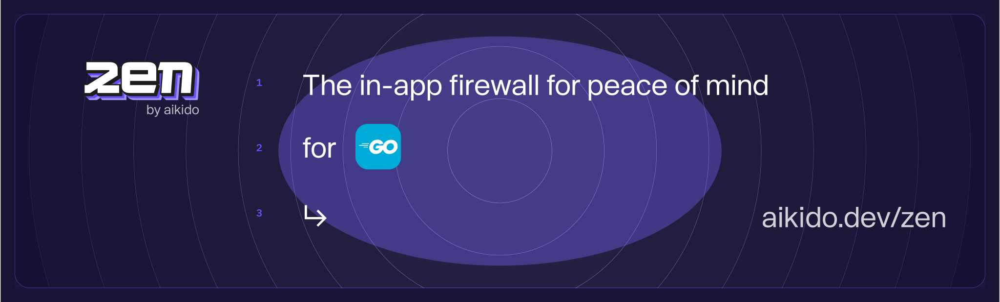

# Zen, in-app firewall for Go | by Aikido

Zen, your in-app firewall for peace of mind– at runtime.

Zen is an embedded Web Application Firewall that autonomously protects your Go apps against common and critical attacks.

Zen does this by scanning user input and matching it with actions made in you web app like executing a SQL query. 
It runs on the same server as your Go app for easy installation and zero maintenance.

## Features

Zen will autonomously protect your Go applications from the inside against:

* 🛡️ [SQL injection attacks](https://www.aikido.dev/blog/the-state-of-sql-injections)
* 🛡️ [Command injection attacks](https://www.aikido.dev/blog/command-injection-in-2024-unpacked)
* 🛡️ [Path traversal attacks](https://owasp.org/www-community/attacks/Path_Traversal)
*  🚧 Server-side request forgery (SSRF)

Zen operates autonomously on the same server as your Go app to:

* ✅ Secure your app like a classic web application firewall (WAF), but with none of the infrastructure or cost.
* ✅ Auto-generate API specifications
* ✅ Block known threat actors and bots.
* ✅ Geo-fencing to block or allow a selection of countries
* ✅ Rate limit specific API endpoints by IP or by user
* ✅ Allow you to block specific users manually

## Supported libraries and frameworks
### Web frameworks
* ✅ [`Gin`](docs/gin.md)
* ✅ [`Echo`](docs/echo.md) v4

### Database drivers
* ✅ [`database/sql`](https://pkg.go.dev/database/sql) - we support all drivers that are made using the built-in interface
* ✅ [`jackc/pgx`](https://github.com/jackc/pgx) v5

## Installation
> 🚧 This area is currently under construction

## Reporting to your Aikido Security dashboard

> Aikido is your no nonsense application security platform. One central system that scans your source code & cloud, shows you what vulnerabilities matter, and how to fix them - fast. So you can get back to building.

Zen is a new product by Aikido. Built for developers to level up their security. While Aikido scans, get Zen for always-on protection.

You can use some of Zen’s features without Aikido, of course. Peace of mind is just a few lines of code away.

But you will get the most value by reporting your data to Aikido.

You will need an Aikido account and a token to report events to Aikido. If you don't have an account, you can [sign up for free](https://app.aikido.dev/login).

Here's how:
* [Log in to your Aikido account](https://app.aikido.dev/login).
* Go to [Zen](https://app.aikido.dev/runtime/services).
* Go to apps.
* Click on **Add app**.
* Choose a name for your app.
* Click **Generate token**.
* Copy the token.
* Set the token as an environment variable, `AIKIDO_TOKEN`, using [dotenv](https://github.com/motdotla/dotenv) or another method of your choosing.

## Running in production (blocking) mode

By default, Zen will only detect and report attacks to Aikido.

To block requests, set the `AIKIDO_BLOCK` environment variable to `true`.

See [Reporting to Aikido](#reporting-to-your-aikido-security-dashboard) to learn how to send events to Aikido.

## Additional configuration

[Configure Zen using environment variables for authentication, mode settings, debugging, and more.](https://help.aikido.dev/doc/configuration-via-env-vars/docrSItUkeR9)

## License

This program is offered under a commercial and under the AGPL license.
You can be released from the requirements of the AGPL license by purchasing
a commercial license. Buying such a license is mandatory as soon as you
develop commercial activities involving the Zen software without
disclosing the source code of your own applications.

For more information, please contact Aikido Security at this
address: support@aikido.dev or create an account at https://app.aikido.dev.

## Benchmarks

We run a benchmark on every commit to ensure Zen has a minimal impact on your application's performance.

See [benchmarks](./benchmarks)

## Contributing

See [CONTRIBUTING.md](.github/CONTRIBUTING.md) for more information.

## Code of Conduct

See [CODE_OF_CONDUCT.md](.github/CODE_OF_CONDUCT.md) for more information.

## Security

See [SECURITY.md](.github/SECURITY.md) for more information.
