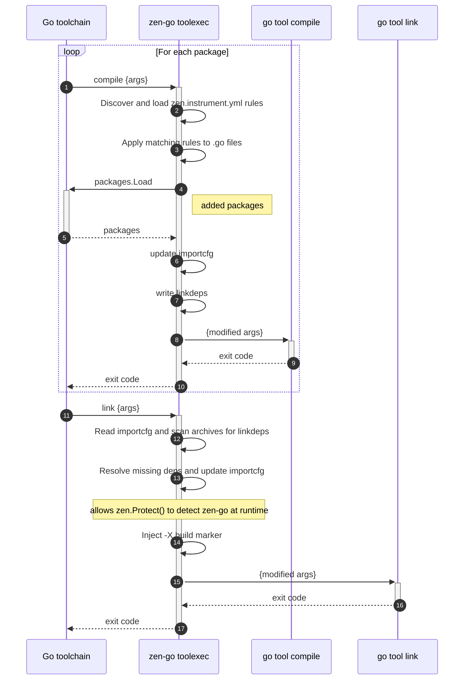

# How It Works

zen-go is the compile-time half of the Go version of Zen. It injects security checks into your application at build time - protecting against SQL injection, path traversal, shell injection, and SSRF - without requiring any changes to your source code.

It works together with the runtime component (`zen.Protect()` and framework middleware), which tracks request context and makes blocking decisions at runtime.

## Overview

zen-go hooks into the Go build process using the `-toolexec` flag. When you build with `go build -toolexec="zen-go toolexec"`, the Go toolchain delegates every compiler and linker invocation through zen-go, giving it a chance to transform code before compilation.

### Compile phase

For each package, zen-go loads all `zen.instrument.yml` rules, parses the `.go` source files, and applies any matching rules. See [instrumentation-rules.md](instrumentation-rules.md) for details.

Transformed files are written to a temporary directory and passed to the compiler in place of the originals. If the rules introduce new imports, zen-go resolves them via `packages.Load` and updates the `-importcfg` file so the compiler can find the added packages.

Some rules (specifically `inject-decl`) create link-time dependencies via `go:linkname` that the linker won't know about. These are recorded in a sidecar file alongside the compiled archive, to be picked up during the link phase.

### Link phase

zen-go scans every archive listed in the linker's `-importcfg` for sidecar link dependency files written during compilation. Any dependencies not already present in the importcfg are resolved and added to an extended importcfg that is passed to the linker.

zen-go also injects a `-X` linker flag that sets a build marker variable. At runtime, `zen.Protect()` checks this variable to verify the binary was compiled with zen-go and can warn if it wasn't.

## Build IDs

The Go toolchain queries each tool's version (`-V=full`) to use as a cache key. zen-go intercepts this and appends a hash of all loaded `zen.instrument.yml` rules to the compiler's version string. This ensures the Go build cache is invalidated whenever instrumentation rules change, forcing recompilation of affected packages.

This is also required to ensure we rebuild the standard library with our instrumentation, such as for the `os` package.
